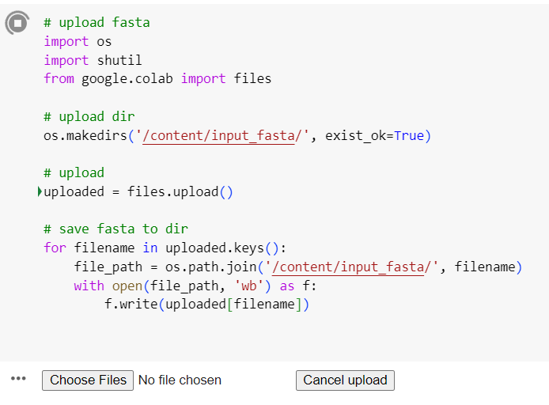
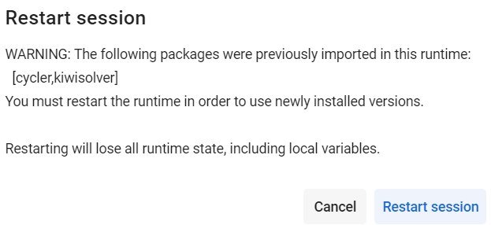

# DeepSS2GO_v2_colab 使用文档

> 本测试均在Colab pro下进行


> 提别说明：如果你有


```
1. JPred: http://www.compbio.dundee.ac.uk/jpred/index.html，网页版，且只能一次提交一个

2. ProtPredicct: http://predictprotein.org,也是网页版，一次提交一个

```


## PART0


- `DeepSS2GO_v2_colab_clean.ipynb`为clean版本
- `DeepSS2GO_v2_colab_example.ipynb`为包含运行数据的版本

## 使用方法

1. 在colab中加载`DeepSS2GO_v2_colab_clean.ipynb`

2. Runtime - run all

3. 上传文件，





## tips: 

因为加载库的先后顺序，会弹出，选择cancel即可。




