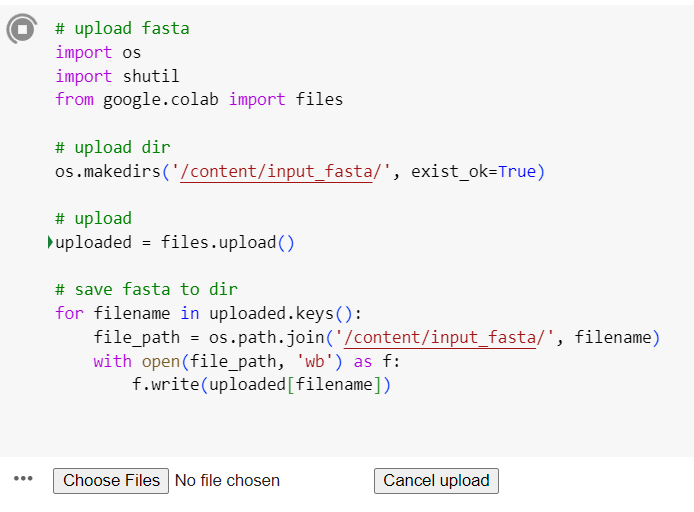
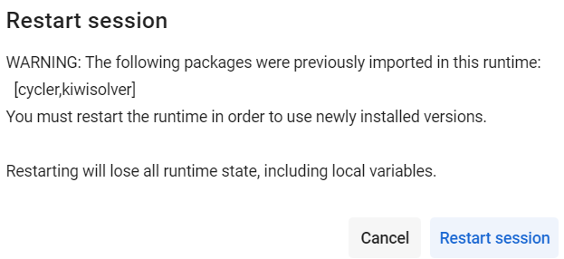
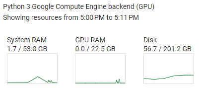

# DeepSS2GO_v2_colab 使用文档

本Repository为DeepSS2GO算法的colab版本。
源代码详见：https://github.com/orca233/DeepSS2GO


细节参见：

```bibtex
@article{song2024deepss2go,
  title={DeepSS2GO: protein function prediction from secondary structure},
  author={Song, Fu V and Su, Jiaqi and Huang, Sixing and Zhang, Neng and Li, Kaiyue and Ni, Ming and Liao, Maofu},
  journal={Briefings in Bioinformatics},
  volume={25},
  number={3},
  year={2024},
  publisher={Oxford University Press}
  doi = {10.1093/bib/bbae196},
  url = {https://doi.org/10.1093/bib/bbae196},
}

```


## 写在前面：
本算法一共分为3个part，
- PART0, 上传fasta文件，环境设置
- PART1，利用SPOT-1D-LM(用到esm & prottrans)将一级序列aa转化为二级结构ss8
- PART2, 结合aa + ss8 + Diamond进行功能预测

Colab有免费版和付费版。
Free版的T4 GPU：显存15.0G，RAM为12.7G
Pro版的 L4 GPU：显存22G，RAM为53G

本算法PART1中用到了模型ProtTrans，免费版不论GPU或CPU下，RAM不够。

> 经测试，path_Prot_T5_XL_UniRef50调用过程中，RSS约5.5GB，VMS约21.3GB


- 如果是Colab付费用户，建议使用`DeepSS2GO_v2_colab_pro.ipynb`，只需要在第一步上传fasta文件，即可一键运行run all。

<!-- - 如果是Colab免费用户，需要提前将一级序列预测成8分类的二级结构。 -->
 
- 如果是Colab免费用户，建议使用`DeepSS2GO_v2_colab_free.ipynb`，需要自己先在其他网站预测出对应氨基酸一级序列的二级结构（8分类），然后将两者一并上传。

> 如果有合适的8分类二级结构在线预测网站，欢迎推荐。

<!--几个二级结构预测网站，仅供参考，貌似只有3分类：

```bash
1. JPred: 
http://www.compbio.dundee.ac.uk/jpred/index.html

2. ProtPredicct: 
http://predictprotein.org

3. psipred: 
http://bioinf.cs.ucl.ac.uk/psipred/
``` -->


## colab_pro 使用方法


1. 在colab中加载`_DeepSS2GO_v2_colab_pro.ipynb`

2. Runtime - run all

3. 上传文件，自动执行 PART 1-3



4. 最后一步自动下载三个文件

results_bp.csv

### colab_pro 上传文件格式如下：

参考格式：`new_aa.fa`
上传位置: `/content/DeepSS2GO_v2_colab/pub_data/data_new/new_aa.fa`

```
>5TV4_1
MGHHHHHHHHHHSSGHIDDDDKHMHNDKDLSTWQTFRRLWPTIAPFKAGLIVAGVALILNAASDTFMLSLLKPLLDDGFGKTDRSVLVWMPLVVIGLMILRGITSYVSSYCISWVSGKVVMTMRRRLFGHMMGMPVSFFDKQSTGTLLSRITYDSEQVASSSSGALITVVREGASIIGLFIMMFYYSWQLSIILIVLAPIVSIAIRVVSKRFRNISKNMQNTMGQVTTSAEQMLKGHKEVLIFGGQEVETKRFDKVSNRMRLQGMKMVSASSISDPIIQLIASLALAFVLYAASFPSVMDSLTAGTITVVFSSMIALMRPLKSLTNVNAQFQRGMAACQTLFTILDSEQEKDEGKRVIERATGDVEFRNVTFTYPGRDVPALRNINLKIPAGKTVALVGRSGSGKSTIASLITRFYDIDEGEILMDGHDLREYTLASLRNQVALVSQNVHLFNDTVANNIAYARTEQYSREQIEEAARMAYAMDFINKMDNGLDTVIGENGVLLSGGQRQRIAIARALLRDSPILILDEATSALDTESERAIQAALDELQKNRTSLVIAHRLSTIEKADEIVVVEDGVIVERGTHNDLLEHRGVYAQLHKMQFGQ
>5TTP_1
MGHHHHHHHHHHSSGHIDDDDKHMHNDKDLSTWQTFRRLWPTIAPFKAGLIVAGVALILNAASDTFMLSLLKPLLDDGFGKTDRSVLVWMPLVVIGLMILRGITSYVSSYCISWVSGKVVMTMRRRLFGHMMGMPVSFFDKQSTGTLLSRITYDSEQVASSSSGALITVVREGASIIGLFIMMFYYSWQLSIILIVLAPIVSIAIRVVSKRFRNISKNMQNTMGQVTTSAEQMLKGHKEVLIFGGQEVETKRFDKVSNRMRLQGMKMVSASSISDPIIQLIASLALAFVLYAASFPSVMDSLTAGTITVVFSSMIALMRPLKSLTNVNAQFQRGMAACQTLFTILDSEQEKDEGKRVIERATGDVEFRNVTFTYPGRDVPALRNINLKIPAGKTVALVGRSGSGKSTIASLITRFYDIDEGEILMDGHDLREYTLASLRNQVALVSQNVHLFNDTVANNIAYARTEQYSREQIEEAARMAYAMDFINKMDNGLDTVIGENGVLLSGGQRQRIAIARALLRDSPILILDEATSALDTESERAIQAALDELQKNRTSLVIAHRLSTIEKADEIVVVEDGVIVERGTHNDLLEHRGVYAQLHKMQFGQ
>6MHU_1
MIIIRYLVRETLKSQLAILFILLLIFFCQKLVRILGAAVDGDIPANLVLSLLGLGVPEMAQLILPLSLFLGLLMTLGKLYTESEITVMHACGLSKAVLVKAAMILAVFTAIVAAVNVMWAGPWSSRHQDEVLAEAKANPGMAALAQGQFQQATNGSSVLFIESVDGSDFKDVFLAQIRPKGNARPSVVVADSGHLTQLRDGSQVVTLNQGTRFEGTALLRDFRITDFQDYQAIIGHQAVALDPNDTDQMDMRTLWNTDTDRARAELNWRITLVFTVFMMALMVVPLSVVNPRQGRVLSMLPAMLLYLLFFLIQTSLKSNGGKGKLDPTLWMWTVNLIYLALAIVLNLWDTVPVRRLRASFSRKGAV
>6MHU_2
MQPFGVLDRYIGKTIFTTIMMTLFMLVSLSGIIKFVDQLKKAGQGSYDALGAGMYTLLSVPKDVQIFFPMAALLGALLGLGMLAQRSELVVMQASGFTRMQVALSVMKTAIPLVLLTMAIGEWVAPQGEQMARNYRAQAMYGGSLLSTQQGLWAKDGNNFVYIERVKGDEELGGISIYAFNENRRLQSVRYAATAKFDPEHKVWRLSQVDESDLTNPKQITGSQTVSGTWKTNLTPDKLGVVALDPDALSISGLHNYVKYLKSSGQDAGRYQLNMWSKIFQPLSVAVMMLMALSFIFGPLRSVPMGVRVVTGISFGFVFYVLDQIFGPLTLVYGIPPIIGALLPSASFFLISLWLLMRKS
>6MHU_3
MGHHHHHHHHMATLTAKNLAKAYKGRRVVEDVSLTVNSGEIVGLLGPNGAGKTTTFYMVVGIVPRDAGNIIIDDDDISLLPLHARARRGIGYLPQEASIFRRLSVYDNLMAVLQIRDDLSAEQREDRANELMEEFHIEHLRDSMGQSLSGGERRRVEIARALAANPKFILLDEPFAGVDPISVIDIKRIIEHLRDSGLGVLITDHNVRETLAVCERAYIVSQGHLIAHGTPTEILQDEHVKRVYLGEDFRL
```


### tips: 

因为加载python库的先后顺序，会弹出几次如下界面，选择cancel即可。




### 时间参考
- 使用L4 GPU, 0.72 unit

- 预测了5条，10min
    - 9min在装py3.8，安装库，下载model，
    - 1min在预测





## colab_free 使用方法

1. 在colab中加载`DeepSS2GO_v2_colab_free.ipynb`

2. 执行：PART0: upload file & env setting

3. 第一步上传文件时选`cancel`

4. 跳过PART1，执行PART2: 上传一级序列文件`new_clean_aa.fa` & 二级结构文件 `new_clean_ss8.fa`

5.  predict


### colab_free上传文件格式如下：

请自行检查：序列长度小于1000，一级序列只包含20种常见氨基酸，二级结构为8分类。

> 8分类请参考DSSP classification, ['C', 'S', 'T', 'H', 'G', 'I', 'E', 'B']
> (https://en.wikipedia.org/wiki/Protein_secondary_structure)


一级序列文件`new_clean_aa.fa`
上传位置: `/content/DeepSS2GO_v2_colab/pub_data/data_new/new_clean_aa.fa
`
```bash
>5TV4_1
MGHHHHHHHHHHSSGHIDDDDKHMHNDKDLSTWQTFRRLWPTIAPFKAGLIVAGVALILNAASDTFMLSLLKPLLDDGFGKTDRSVLVWMPLVVIGLMILRGITSYVSSYCISWVSGKVVMTMRRRLFGHMMGMPVSFFDKQSTGTLLSRITYDSEQVASSSSGALITVVREGASIIGLFIMMFYYSWQLSIILIVLAPIVSIAIRVVSKRFRNISKNMQNTMGQVTTSAEQMLKGHKEVLIFGGQEVETKRFDKVSNRMRLQGMKMVSASSISDPIIQLIASLALAFVLYAASFPSVMDSLTAGTITVVFSSMIALMRPLKSLTNVNAQFQRGMAACQTLFTILDSEQEKDEGKRVIERATGDVEFRNVTFTYPGRDVPALRNINLKIPAGKTVALVGRSGSGKSTIASLITRFYDIDEGEILMDGHDLREYTLASLRNQVALVSQNVHLFNDTVANNIAYARTEQYSREQIEEAARMAYAMDFINKMDNGLDTVIGENGVLLSGGQRQRIAIARALLRDSPILILDEATSALDTESERAIQAALDELQKNRTSLVIAHRLSTIEKADEIVVVEDGVIVERGTHNDLLEHRGVYAQLHKMQFGQ
>5TTP_1
MGHHHHHHHHHHSSGHIDDDDKHMHNDKDLSTWQTFRRLWPTIAPFKAGLIVAGVALILNAASDTFMLSLLKPLLDDGFGKTDRSVLVWMPLVVIGLMILRGITSYVSSYCISWVSGKVVMTMRRRLFGHMMGMPVSFFDKQSTGTLLSRITYDSEQVASSSSGALITVVREGASIIGLFIMMFYYSWQLSIILIVLAPIVSIAIRVVSKRFRNISKNMQNTMGQVTTSAEQMLKGHKEVLIFGGQEVETKRFDKVSNRMRLQGMKMVSASSISDPIIQLIASLALAFVLYAASFPSVMDSLTAGTITVVFSSMIALMRPLKSLTNVNAQFQRGMAACQTLFTILDSEQEKDEGKRVIERATGDVEFRNVTFTYPGRDVPALRNINLKIPAGKTVALVGRSGSGKSTIASLITRFYDIDEGEILMDGHDLREYTLASLRNQVALVSQNVHLFNDTVANNIAYARTEQYSREQIEEAARMAYAMDFINKMDNGLDTVIGENGVLLSGGQRQRIAIARALLRDSPILILDEATSALDTESERAIQAALDELQKNRTSLVIAHRLSTIEKADEIVVVEDGVIVERGTHNDLLEHRGVYAQLHKMQFGQ
>6MHU_1
MIIIRYLVRETLKSQLAILFILLLIFFCQKLVRILGAAVDGDIPANLVLSLLGLGVPEMAQLILPLSLFLGLLMTLGKLYTESEITVMHACGLSKAVLVKAAMILAVFTAIVAAVNVMWAGPWSSRHQDEVLAEAKANPGMAALAQGQFQQATNGSSVLFIESVDGSDFKDVFLAQIRPKGNARPSVVVADSGHLTQLRDGSQVVTLNQGTRFEGTALLRDFRITDFQDYQAIIGHQAVALDPNDTDQMDMRTLWNTDTDRARAELNWRITLVFTVFMMALMVVPLSVVNPRQGRVLSMLPAMLLYLLFFLIQTSLKSNGGKGKLDPTLWMWTVNLIYLALAIVLNLWDTVPVRRLRASFSRKGAV
>6MHU_2
MQPFGVLDRYIGKTIFTTIMMTLFMLVSLSGIIKFVDQLKKAGQGSYDALGAGMYTLLSVPKDVQIFFPMAALLGALLGLGMLAQRSELVVMQASGFTRMQVALSVMKTAIPLVLLTMAIGEWVAPQGEQMARNYRAQAMYGGSLLSTQQGLWAKDGNNFVYIERVKGDEELGGISIYAFNENRRLQSVRYAATAKFDPEHKVWRLSQVDESDLTNPKQITGSQTVSGTWKTNLTPDKLGVVALDPDALSISGLHNYVKYLKSSGQDAGRYQLNMWSKIFQPLSVAVMMLMALSFIFGPLRSVPMGVRVVTGISFGFVFYVLDQIFGPLTLVYGIPPIIGALLPSASFFLISLWLLMRKS
>6MHU_3
MGHHHHHHHHMATLTAKNLAKAYKGRRVVEDVSLTVNSGEIVGLLGPNGAGKTTTFYMVVGIVPRDAGNIIIDDDDISLLPLHARARRGIGYLPQEASIFRRLSVYDNLMAVLQIRDDLSAEQREDRANELMEEFHIEHLRDSMGQSLSGGERRRVEIARALAANPKFILLDEPFAGVDPISVIDIKRIIEHLRDSGLGVLITDHNVRETLAVCERAYIVSQGHLIAHGTPTEILQDEHVKRVYLGEDFRL

```


二级结构文件 `new_clean_ss8.fa`
上传位置：`/content/DeepSS2GO_v2_colab/pub_data/data_new/new_clean_ss8.fa`
```bash
>5TV4_1
CCCCCCCCCCCCCCCCCCCCCCCCCCCCCCCHHHHHHHHHHHHGGGHHHHHHHHHHHHHHHHHHHHHHHHHHHHHHHTTTSCCHHHHHHHHHHHHHHHHHHHHHHHHHHHHHHHHHHHHHHHHHHHHHHHHHTSCHHHHHHSCHHHHHHHHHHHHHHHHHHHHHHHHHHHHHHHHHHHHHHHHHHHCHHHHHHHHHHHHHHHHHHHHHHHHHHHHHHHHHHHHHHHHHHHHHHHHTHHHHHHTTCHHHHHHHHHHHHHHHHHHHHHHHHHHHHHHHHHHHHHHHHHHHHHHHHHSTTHHTTCCHHHHHHHHHHHHHHHHHHHHHHHHHHHHHHHHHHHHHHHHHHHSCCCCCCSSECCSCCCCCEEEEEEEEECTTCSSCSEEEEEEEECTTCEEEEECSTTSSHHHHHHHHTTSSCCSEEEEEETTEEGGGBCHHHHHHTEEEECSSCCCCSSBHHHHHHTTCSSCCCHHHHHHHHHHTTCHHHHHTSTTGGGCBCCTTSCCCCHHHHHHHHHHHHHHTCCSEEEEESTTSCCCHHHHHHHHHHHHHHHTTSEEEEECSCHHHHTTCSEEEEEETTEEEEEECHHHHHHTTSHHHHHHHHHCCC
>5TTP_1
CCCCCCCCCCCCCCCCCCCCCCCCCCCCCCCHHHHHHHHHHHHGGGHHHHHHHHHHHHHHHHHHHHHHHHHHHHHHHTTTSCCHHHHHHHHHHHHHHHHHHHHHHHHHHHHHHHHHHHHHHHHHHHHHHHHHTSCHHHHHHSCHHHHHHHHHHHHHHHHHHHHHHHHHHHHHHHHHHHHHHHHHHHCHHHHHHHHHHHHHHHHHHHHHHHHHHHHHHHHHHHHHHHHHHHHHHHHTHHHHHHTTCHHHHHHHHHHHHHHHHHHHHHHHHHHHHHHHHHHHHHHHHHHHHHHHHHSTTHHTTCCHHHHHHHHHHHHHHHHHHHHHHHHHHHHHHHHHHHHHHHHHHHSCCCCCCSSECCSCCCCCEEEEEEEEECTTCSSCSEEEEEEEECTTCEEEEECSTTSSHHHHHHHHTTSSCCSEEEEEETTEEGGGBCHHHHHHTEEEECSSCCCCSSBHHHHHHTTCSSCCCHHHHHHHHHHTTCHHHHHTSTTGGGCBCCTTSCCCCHHHHHHHHHHHHHHTCCSEEEEESTTSCCCHHHHHHHHHHHHHHHTTSEEEEECSCHHHHTTCSEEEEEETTEEEEEECHHHHHHTTSHHHHHHHHHCCC
>6MHU_1
CHHHHHHHHHHHHHHHHHHHHHHHHHHHHHHHHHHHHHHTTCCCHHHHHHHHHHHHHHHHHHHHHHHHHHHHHHHHHHHHHHCHHHHHHHTTCCHHHHHHHHHHHHHHHHHHHHHHHHTHHHHHHHHHHHHHHHHHHCCCGGGCCTTEEEECTTSSEEEEEEEEETTEEEEEEEEEECCSSCCCCEEEEESEEEEEECTTSCEEEEEEEEEEEEECTTSSCCEEEEEEEEEEEECCCCCCCCCCCCCCCCHHHHHTCCCHHHHHHHHHHHHHHHHHHHHHHHHHHGHCCCTTCCHHHHHHHHHHHHHHHHHHHHHHHHHHHTTSSCHHHHHHHHHHHHHHHHHHHHHTTCCHHHHHHHHHCCCCCC
>6MHU_2
CCCCCHHHHHHHHHHHHHHHHHHHHHHHHHHHHHHHHHHHHHCSSCCCHHHHHHHHHHHHHHHHHHHHHHHHHHHHHHHHHHHHHTCHHHHHHHTTCCHHHHHHHHHHHHHHHHHHHHHHHHHHHHHHHHHHHHHHHHHHHCCCCCCCCCCEEEEETTEEEEEEEEETTTEEEEEEEEEECTTSCEEEEEEESEEEEETTTTEEEEEEEEEEETSCTTCCEEEEECEEEECCSCCHHHHHHHCCCGGGCCHHHHHHHHHHHHHTTCCHHHHHHHHHHHHHHHHHHHHHHHHHHHHHCCCCTSSCHHHHHHHHHHHHHHHHHHHHHHHHHHHHHCCCHHHHHHHHHHHHHHHHHHHHHCCC
>6MHU_3
CCCCCCCCCCCCEEEEEEEEEEETTEEEEEEEEEEEETTCEEEEECCTTSSHHHHHHHHHTSSCCSEEEEEETTEECTTSCHHHHHHTTEEEECSSCCCCTTSCHHHHHHHHHHTCTTSCHHHHHHHHHHHHHHTTCGGGTTSBGGGSCHHHHHHHHHHHHHHTCCSEEEEECTTTTSCHHHHHHHHHHHHHHHHTTCEEEEEESCHHHHHHHCSEEEEEETTEEEEEECHHHHHTCHHHHHHHHCTTCCC

```


