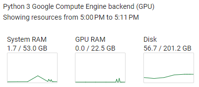

# DeepSS2GO_v2_colab User Guide

## Preface:
This algorithm is divided into 3 parts:
- PART0: Upload fasta files and set up the environment
- PART1: Use SPOT-1D-LM (utilizing esm & prottrans) to convert primary sequence aa into secondary structure ss8
- PART2: Combine aa + ss8 + Diamond for function prediction

Colab offers both free and paid versions.
- Free version with T4 GPU: 15.0G VRAM, 12.7G RAM
- Pro version with L4 GPU: 22G VRAM, 53G RAM

In PART1 of this algorithm, the ProtTrans model is used. The RAM is insufficient on the free version, whether using GPU or CPU.

> According to tests, during the path_Prot_T5_XL_UniRef50 call, RSS is about 5.5GB, and VMS is about 21.3GB.

- For Colab Pro users, it is recommended to use `DeepSS2GO_v2_colab_pro.ipynb`. Just upload the fasta file in the first step, and you can run all cells with one click.

<!-- - For Colab free users, you need to predict the primary sequence into 8-class secondary structure in advance. -->

- For Colab free users, it is recommended to use `DeepSS2GO_v2_colab_free.ipynb`. You need to predict the corresponding secondary structure (8-class) of the primary amino acid sequence on other websites and upload both together.

> If you know of any suitable 8-class secondary structure online prediction websites, feel free to recommend them.

<!-- Several secondary structure prediction websites for reference, they seem to only offer 3-class:

```bash
1. JPred: 
http://www.compbio.dundee.ac.uk/jpred/index.html

2. ProtPredicct: 
http://predictprotein.org

3. psipred: 
http://bioinf.cs.ucl.ac.uk/psipred/
``` -->

## colab_pro Usage Guide

1. Load `DeepSS2GO_v2_colab.ipynb` in Colab

2. Runtime - run all

3. Upload files, automatically execute PART 1-3


4. The last step will automatically download three files:
   - results_bp.csv

### colab_pro Upload File Format:

Reference format: `new_aa.fa`
Upload location: `/content/DeepSS2GO_v2_colab/pub_data/data_new/new_aa.fa`


```bash
>5TV4_1
MGHHHHHHHHHHSSGHIDDDDKHMHNDKDLSTWQTFRRLWPTIAPFKAGLIVAGVALILNAASDTFMLSLLKPLLDDGFGKTDRSVLVWMPLVVIGLMILRGITSYVSSYCISWVSGKVVMTMRRRLFGHMMGMPVSFFDKQSTGTLLSRITYDSEQVASSSSGALITVVREGASIIGLFIMMFYYSWQLSIILIVLAPIVSIAIRVVSKRFRNISKNMQNTMGQVTTSAEQMLKGHKEVLIFGGQEVETKRFDKVSNRMRLQGMKMVSASSISDPIIQLIASLALAFVLYAASFPSVMDSLTAGTITVVFSSMIALMRPLKSLTNVNAQFQRGMAACQTLFTILDSEQEKDEGKRVIERATGDVEFRNVTFTYPGRDVPALRNINLKIPAGKTVALVGRSGSGKSTIASLITRFYDIDEGEILMDGHDLREYTLASLRNQVALVSQNVHLFNDTVANNIAYARTEQYSREQIEEAARMAYAMDFINKMDNGLDTVIGENGVLLSGGQRQRIAIARALLRDSPILILDEATSALDTESERAIQAALDELQKNRTSLVIAHRLSTIEKADEIVVVEDGVIVERGTHNDLLEHRGVYAQLHKMQFGQ
>5TTP_1
MGHHHHHHHHHHSSGHIDDDDKHMHNDKDLSTWQTFRRLWPTIAPFKAGLIVAGVALILNAASDTFMLSLLKPLLDDGFGKTDRSVLVWMPLVVIGLMILRGITSYVSSYCISWVSGKVVMTMRRRLFGHMMGMPVSFFDKQSTGTLLSRITYDSEQVASSSSGALITVVREGASIIGLFIMMFYYSWQLSIILIVLAPIVSIAIRVVSKRFRNISKNMQNTMGQVTTSAEQMLKGHKEVLIFGGQEVETKRFDKVSNRMRLQGMKMVSASSISDPIIQLIASLALAFVLYAASFPSVMDSLTAGTITVVFSSMIALMRPLKSLTNVNAQFQRGMAACQTLFTILDSEQEKDEGKRVIERATGDVEFRNVTFTYPGRDVPALRNINLKIPAGKTVALVGRSGSGKSTIASLITRFYDIDEGEILMDGHDLREYTLASLRNQVALVSQNVHLFNDTVANNIAYARTEQYSREQIEEAARMAYAMDFINKMDNGLDTVIGENGVLLSGGQRQRIAIARALLRDSPILILDEATSALDTESERAIQAALDELQKNRTSLVIAHRLSTIEKADEIVVVEDGVIVERGTHNDLLEHRGVYAQLHKMQFGQ
>6MHU_1
MIIIRYLVRETLKSQLAILFILLLIFFCQKLVRILGAAVDGDIPANLVLSLLGLGVPEMAQLILPLSLFLGLLMTLGKLYTESEITVMHACGLSKAVLVKAAMILAVFTAIVAAVNVMWAGPWSSRHQDEVLAEAKANPGMAALAQGQFQQATNGSSVLFIESVDGSDFKDVFLAQIRPKGNARPSVVVADSGHLTQLRDGSQVVTLNQGTRFEGTALLRDFRITDFQDYQAIIGHQAVALDPNDTDQMDMRTLWNTDTDRARAELNWRITLVFTVFMMALMVVPLSVVNPRQGRVLSMLPAMLLYLLFFLIQTSLKSNGGKGKLDPTLWMWTVNLIYLALAIVLNLWDTVPVRRLRASFSRKGAV
>6MHU_2
MQPFGVLDRYIGKTIFTTIMMTLFMLVSLSGIIKFVDQLKKAGQGSYDALGAGMYTLLSVPKDVQIFFPMAALLGALLGLGMLAQRSELVVMQASGFTRMQVALSVMKTAIPLVLLTMAIGEWVAPQGEQMARNYRAQAMYGGSLLSTQQGLWAKDGNNFVYIERVKGDEELGGISIYAFNENRRLQSVRYAATAKFDPEHKVWRLSQVDESDLTNPKQITGSQTVSGTWKTNLTPDKLGVVALDPDALSISGLHNYVKYLKSSGQDAGRYQLNMWSKIFQPLSVAVMMLMALSFIFGPLRSVPMGVRVVTGISFGFVFYVLDQIFGPLTLVYGIPPIIGALLPSASFFLISLWLLMRKS
>6MHU_3
MGHHHHHHHHMATLTAKNLAKAYKGRRVVEDVSLTVNSGEIVGLLGPNGAGKTTTFYMVVGIVPRDAGNIIIDDDDISLLPLHARARRGIGYLPQEASIFRRLSVYDNLMAVLQIRDDLSAEQREDRANELMEEFHIEHLRDSMGQSLSGGERRRVEIARALAANPKFILLDEPFAGVDPISVIDIKRIIEHLRDSGLGVLITDHNVRETLAVCERAYIVSQGHLIAHGTPTEILQDEHVKRVYLGEDFRL

```


### Tips:

Due to the order of loading Python libraries, the following window will pop up several times. Select cancel.


### Time Reference
- Using L4 GPU, 0.72 unit
- Predicted 5 sequences, 10min
    - 9min for installing py3.8, installing libraries, and downloading model
    - 1min for prediction




## colab_free Usage Guide

1. Load `DeepSS2GO_v2_colab.ipynb` in Colab

2. Execute: PART0: upload file & env setting

3. Select `cancel` when uploading the file in the first step

4. Skip PART1, execute PART2: Upload primary sequence file `new_clean_aa.fa` & secondary structure file `new_clean_ss8.fa`

5. Predict


### colab_free Upload File Format:

Please check yourself: sequence length is less than 1000, primary sequence contains only 20 common amino acids, secondary structure is 8-class.

> For 8-class, refer to DSSP classification, ['C', 'S', 'T', 'H', 'G', 'I', 'E', 'B'] (https://en.wikipedia.org/wiki/Protein_secondary_structure)

Primary sequence file `new_clean_aa.fa`
Upload location: `/content/DeepSS2GO_v2_colab/pub_data/data_new/new_clean_aa.fa`


```bash
>5TV4_1
MGHHHHHHHHHHSSGHIDDDDKHMHNDKDLSTWQTFRRLWPTIAPFKAGLIVAGVALILNAASDTFMLSLLKPLLDDGFGKTDRSVLVWMPLVVIGLMILRGITSYVSSYCISWVSGKVVMTMRRRLFGHMMGMPVSFFDKQSTGTLLSRITYDSEQVASSSSGALITVVREGASIIGLFIMMFYYSWQLSIILIVLAPIVSIAIRVVSKRFRNISKNMQNTMGQVTTSAEQMLKGHKEVLIFGGQEVETKRFDKVSNRMRLQGMKMVSASSISDPIIQLIASLALAFVLYAASFPSVMDSLTAGTITVVFSSMIALMRPLKSLTNVNAQFQRGMAACQTLFTILDSEQEKDEGKRVIERATGDVEFRNVTFTYPGRDVPALRNINLKIPAGKTVALVGRSGSGKSTIASLITRFYDIDEGEILMDGHDLREYTLASLRNQVALVSQNVHLFNDTVANNIAYARTEQYSREQIEEAARMAYAMDFINKMDNGLDTVIGENGVLLSGGQRQRIAIARALLRDSPILILDEATSALDTESERAIQAALDELQKNRTSLVIAHRLSTIEKADEIVVVEDGVIVERGTHNDLLEHRGVYAQLHKMQFGQ
>5TTP_1
MGHHHHHHHHHHSSGHIDDDDKHMHNDKDLSTWQTFRRLWPTIAPFKAGLIVAGVALILNAASDTFMLSLLKPLLDDGFGKTDRSVLVWMPLVVIGLMILRGITSYVSSYCISWVSGKVVMTMRRRLFGHMMGMPVSFFDKQSTGTLLSRITYDSEQVASSSSGALITVVREGASIIGLFIMMFYYSWQLSIILIVLAPIVSIAIRVVSKRFRNISKNMQNTMGQVTTSAEQMLKGHKEVLIFGGQEVETKRFDKVSNRMRLQGMKMVSASSISDPIIQLIASLALAFVLYAASFPSVMDSLTAGTITVVFSSMIALMRPLKSLTNVNAQFQRGMAACQTLFTILDSEQEKDEGKRVIERATGDVEFRNVTFTYPGRDVPALRNINLKIPAGKTVALVGRSGSGKSTIASLITRFYDIDEGEILMDGHDLREYTLASLRNQVALVSQNVHLFNDTVANNIAYARTEQYSREQIEEAARMAYAMDFINKMDNGLDTVIGENGVLLSGGQRQRIAIARALLRDSPILILDEATSALDTESERAIQAALDELQKNRTSLVIAHRLSTIEKADEIVVVEDGVIVERGTHNDLLEHRGVYAQLHKMQFGQ
>6MHU_1
MIIIRYLVRETLKSQLAILFILLLIFFCQKLVRILGAAVDGDIPANLVLSLLGLGVPEMAQLILPLSLFLGLLMTLGKLYTESEITVMHACGLSKAVLVKAAMILAVFTAIVAAVNVMWAGPWSSRHQDEVLAEAKANPGMAALAQGQFQQATNGSSVLFIESVDGSDFKDVFLAQIRPKGNARPSVVVADSGHLTQLRDGSQVVTLNQGTRFEGTALLRDFRITDFQDYQAIIGHQAVALDPNDTDQMDMRTLWNTDTDRARAELNWRITLVFTVFMMALMVVPLSVVNPRQGRVLSMLPAMLLYLLFFLIQTSLKSNGGKGKLDPTLWMWTVNLIYLALAIVLNLWDTVPVRRLRASFSRKGAV
>6MHU_2
MQPFGVLDRYIGKTIFTTIMMTLFMLVSLSGIIKFVDQLKKAGQGSYDALGAGMYTLLSVPKDVQIFFPMAALLGALLGLGMLAQRSELVVMQASGFTRMQVALSVMKTAIPLVLLTMAIGEWVAPQGEQMARNYRAQAMYGGSLLSTQQGLWAKDGNNFVYIERVKGDEELGGISIYAFNENRRLQSVRYAATAKFDPEHKVWRLSQVDESDLTNPKQITGSQTVSGTWKTNLTPDKLGVVALDPDALSISGLHNYVKYLKSSGQDAGRYQLNMWSKIFQPLSVAVMMLMALSFIFGPLRSVPMGVRVVTGISFGFVFYVLDQIFGPLTLVYGIPPIIGALLPSASFFLISLWLLMRKS
>6MHU_3
MGHHHHHHHHMATLTAKNLAKAYKGRRVVEDVSLTVNSGEIVGLLGPNGAGKTTTFYMVVGIVPRDAGNIIIDDDDISLLPLHARARRGIGYLPQEASIFRRLSVYDNLMAVLQIRDDLSAEQREDRANELMEEFHIEHLRDSMGQSLSGGERRRVEIARALAANPKFILLDEPFAGVDPISVIDIKRIIEHLRDSGLGVLITDHNVRETLAVCERAYIVSQGHLIAHGTPTEILQDEHVKRVYLGEDFRL

```


Secondary structure file: `new_clean_ss8.fa`
Upload location: `/content/DeepSS2GO_v2_colab/pub_data/data_new/new_clean_ss8.fa`

```bash
>5TV4_1
CCCCCCCCCCCCCCCCCCCCCCCCCCCCCCCHHHHHHHHHHHHGGGHHHHHHHHHHHHHHHHHHHHHHHHHHHHHHHTTTSCCHHHHHHHHHHHHHHHHHHHHHHHHHHHHHHHHHHHHHHHHHHHHHHHHHTSCHHHHHHSCHHHHHHHHHHHHHHHHHHHHHHHHHHHHHHHHHHHHHHHHHHHCHHHHHHHHHHHHHHHHHHHHHHHHHHHHHHHHHHHHHHHHHHHHHHHHTHHHHHHTTCHHHHHHHHHHHHHHHHHHHHHHHHHHHHHHHHHHHHHHHHHHHHHHHHHSTTHHTTCCHHHHHHHHHHHHHHHHHHHHHHHHHHHHHHHHHHHHHHHHHHHSCCCCCCSSECCSCCCCCEEEEEEEEECTTCSSCSEEEEEEEECTTCEEEEECSTTSSHHHHHHHHTTSSCCSEEEEEETTEEGGGBCHHHHHHTEEEECSSCCCCSSBHHHHHHTTCSSCCCHHHHHHHHHHTTCHHHHHTSTTGGGCBCCTTSCCCCHHHHHHHHHHHHHHTCCSEEEEESTTSCCCHHHHHHHHHHHHHHHTTSEEEEECSCHHHHTTCSEEEEEETTEEEEEECHHHHHHTTSHHHHHHHHHCCC
>5TTP_1
CCCCCCCCCCCCCCCCCCCCCCCCCCCCCCCHHHHHHHHHHHHGGGHHHHHHHHHHHHHHHHHHHHHHHHHHHHHHHTTTSCCHHHHHHHHHHHHHHHHHHHHHHHHHHHHHHHHHHHHHHHHHHHHHHHHHTSCHHHHHHSCHHHHHHHHHHHHHHHHHHHHHHHHHHHHHHHHHHHHHHHHHHHCHHHHHHHHHHHHHHHHHHHHHHHHHHHHHHHHHHHHHHHHHHHHHHHHTHHHHHHTTCHHHHHHHHHHHHHHHHHHHHHHHHHHHHHHHHHHHHHHHHHHHHHHHHHSTTHHTTCCHHHHHHHHHHHHHHHHHHHHHHHHHHHHHHHHHHHHHHHHHHHSCCCCCCSSECCSCCCCCEEEEEEEEECTTCSSCSEEEEEEEECTTCEEEEECSTTSSHHHHHHHHTTSSCCSEEEEEETTEEGGGBCHHHHHHTEEEECSSCCCCSSBHHHHHHTTCSSCCCHHHHHHHHHHTTCHHHHHTSTTGGGCBCCTTSCCCCHHHHHHHHHHHHHHTCCSEEEEESTTSCCCHHHHHHHHHHHHHHHTTSEEEEECSCHHHHTTCSEEEEEETTEEEEEECHHHHHHTTSHHHHHHHHHCCC
>6MHU_1
CHHHHHHHHHHHHHHHHHHHHHHHHHHHHHHHHHHHHHHTTCCCHHHHHHHHHHHHHHHHHHHHHHHHHHHHHHHHHHHHHHCHHHHHHHTTCCHHHHHHHHHHHHHHHHHHHHHHHHTHHHHHHHHHHHHHHHHHHCCCGGGCCTTEEEECTTSSEEEEEEEEETTEEEEEEEEEECCSSCCCCEEEEESEEEEEECTTSCEEEEEEEEEEEEECTTSSCCEEEEEEEEEEEECCCCCCCCCCCCCCCCHHHHHTCCCHHHHHHHHHHHHHHHHHHHHHHHHHHGHCCCTTCCHHHHHHHHHHHHHHHHHHHHHHHHHHHTTSSCHHHHHHHHHHHHHHHHHHHHHTTCCHHHHHHHHHCCCCCC
>6MHU_2
CCCCCHHHHHHHHHHHHHHHHHHHHHHHHHHHHHHHHHHHHHCSSCCCHHHHHHHHHHHHHHHHHHHHHHHHHHHHHHHHHHHHHTCHHHHHHHTTCCHHHHHHHHHHHHHHHHHHHHHHHHHHHHHHHHHHHHHHHHHHHCCCCCCCCCCEEEEETTEEEEEEEEETTTEEEEEEEEEECTTSCEEEEEEESEEEEETTTTEEEEEEEEEEETSCTTCCEEEEECEEEECCSCCHHHHHHHCCCGGGCCHHHHHHHHHHHHHTTCCHHHHHHHHHHHHHHHHHHHHHHHHHHHHHCCCCTSSCHHHHHHHHHHHHHHHHHHHHHHHHHHHHHCCCHHHHHHHHHHHHHHHHHHHHHCCC
>6MHU_3
CCCCCCCCCCCCEEEEEEEEEEETTEEEEEEEEEEEETTCEEEEECCTTSSHHHHHHHHHTSSCCSEEEEEETTEECTTSCHHHHHHTTEEEECSSCCCCTTSCHHHHHHHHHHTCTTSCHHHHHHHHHHHHHHTTCGGGTTSBGGGSCHHHHHHHHHHHHHHTCCSEEEEECTTTTSCHHHHHHHHHHHHHHHHTTCEEEEEESCHHHHHHHCSEEEEEETTEEEEEECHHHHHTCHHHHHHHHCTTCCC

```


